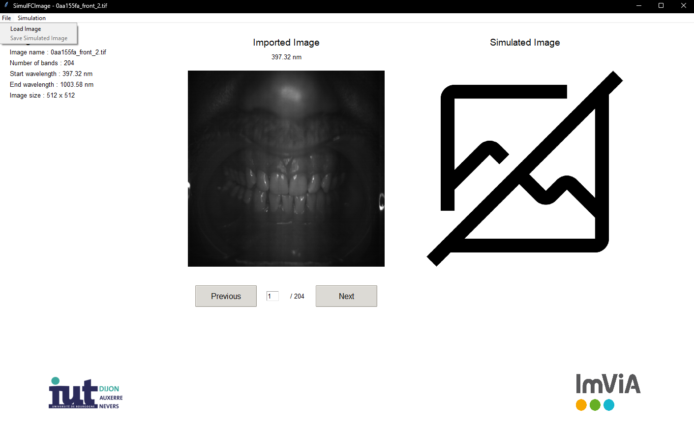
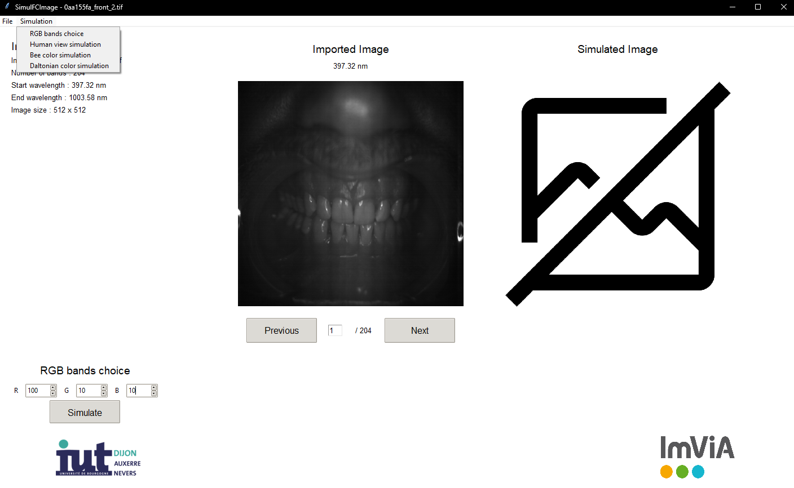

<h1>SimulFCImage - LaBabaTcheam C1</h1>

<h2>Project Overview</h2>
<p>SimulFCImage is a sophisticated Python application designed for multispectral image analysis and visualization. It transforms complex multispectral data into comprehensible color representations through various simulation methods, making it an invaluable tool for research and analysis.</p>

<h2>Key Features</h2>

<h3>1. Human Vision Simulation ("True Color")</h3>
<p>Simulates human color perception based on the CIE 1931 color matching functions and Stockman & Sharpe (2000) cone fundamentals:
- L-cones (red): peak at 566.8nm
- M-cones (green): peak at 541.2nm
- S-cones (blue): peak at 441.8nm
This provides an accurate representation of how the human eye would perceive the multispectral image.</p>

<h3>2. Custom Band Mapping ("False Color")</h3>
<p>Enables manual assignment of specific spectral bands to RGB channels, allowing users to:
- Highlight features invisible to the human eye
- Emphasize specific wavelength ranges
- Create custom visualization schemes for analysis</p>

<h3>3. Bee Vision Simulation</h3>
<p>Models bee photoreceptor response based on scientific research (Peitsch et al., 1992):
- UV receptor: peak at 344nm (±1nm)
- Blue receptor: peak at 436nm (±3nm)
- Green receptor: peak at 544nm (±3nm)
Provides insights into how bees perceive the multispectral image.</p>

<h3>4. Color Vision Deficiency Simulation</h3>
<p>Simulates various types of color vision deficiencies based on Brettel et al. (1997) and Machado et al. (2009):
- Deuteranopia (green-blind)
- Protanopia (red-blind)
- Tritanopia (blue-blind)
- Deuteranomaly (green-weak)
- Protanomaly (red-weak)
- Tritanomaly (blue-weak)
- Achromatopsia (complete color blindness)</p>

<h2>Installation Guide</h2>

<h3>Option 1: Pre-compiled Application</h3>
1. Download SimulFCImage setup.exe from Google Drive ( https://drive.google.com/drive/folders/1uRv_wMsNEgHqScpr94n4Br1E7VYtcmYx?usp=sharing ) <br>
2. Launch SimulFCImage setup.exe <br>
3. (Optional) Download sample multispectral images from the "Teeth" folder

<h3>Option 2: Building from Source</h3>
1. Clone the repository <br>
2. Install dependencies:

```bash
pip install Pillow numpy cx_Freeze
```
3. Run Program.py to compile and launch the application

<h2>Usage Guide</h2>

<h3>Loading Images</h3>
1. Click "Import an image" on the upper band <br>
2. Select a multispectral image (.tiff format) <br>
3. Import the corresponding metadata file (.txt) <br>
4. Navigate through bands using "Previous" and "Next" buttons




<h3>Generating Color Images</h3>
1. Click "Generate a color image" on the upper band <br>
2. Select a simulation method:
   - True Color (Human Vision)
   - RGB Bands Choice (Custom Mapping)
   - Bee Vision
   - Color Vision Deficiency <br>
3. Configure method-specific parameters if required <br>
4. Click "Simulate" to generate the image


<h3>Results and Export</h3>
- The generated image appears alongside the original
- Use the "Save" button to export in various formats (.png, .jpg, .tif)


<h2>Project Architecture</h2>

```bash
S5_C1_LaBabaTcheam
├─Exceptions
│ └─...
├─HMI
│ ├─assets
│ │ └─...
│ ├─MainWindow.py
│ └─SimulationChoiceWindow.py
├─LogicLayer
│ ├─Factory
│ │ ├─CreateSimulating
│ │ │ ├─ CreateBandChoiceSimulating.py
│ │ │ ├─ CreateBeeSimulating.py
│ │ │ ├─ CreateDaltonianSimulating.py
│ │ │ ├─ CreateHumanSimulating.py
│ │ │ └─ ICreateSimulator.py
│ │ ├─Simulating
│ │ │ ├─ BandChoiceSimulating.py
│ │ │ ├─ BeeSimulating.py
│ │ │ ├─ DaltonianSimulating.py
│ │ │ ├─ HumanSimulating.py
│ │ │ └─ SimulatingMethod.py
│ └─└─SimulatorFactory.py
│ ├─Band.py
│ └─ImageMS.py
├─Storage
│ ├─FileManager.py
│ └─ImageManager.py
├─UnitTests
│ └─...
├─.gitignore
├─Program.py
├─README.md
└─setup.py
```
